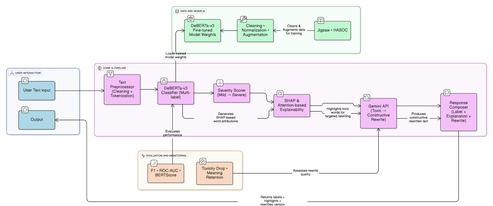
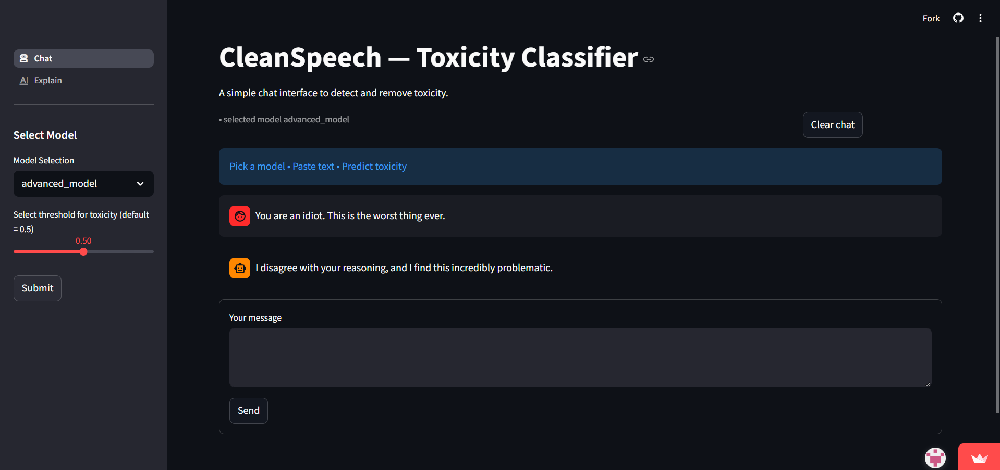
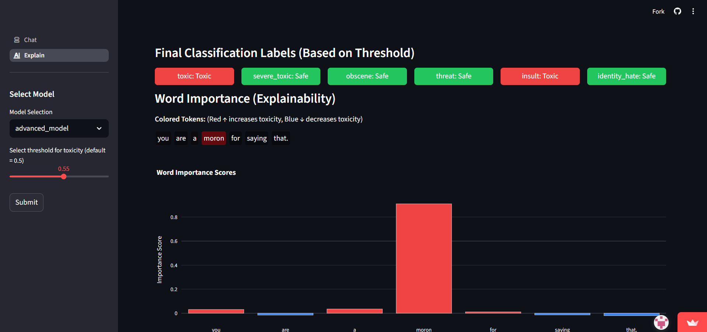

<div align="center">

<h1 style="align=center">CleanSpeech</h1>

<p><i>Toxicity Detection and Rewriting with Explainable AI</i></p>

</div>

<p align="center">
  
  
  
  
  
</p>


> CleanSpeech fine-tunes **mDeBERTa-v3-base** for multi-label toxicity classification and  
> uses **Gemini API** to rewrite harmful text into non-toxic alternatives.
> A Streamlit UI provides real-time predictions and **SHAP-based explainability**.

---

## Milestone Progress
| Milestone | Description | Status |
|----------|-------------|--------|
| 1. Problem Definition & Literature Review | Defined project goals, reviewed prior work on toxicity detection, rewriting, and explainability. |  |
| 2. Data Preparation & Preprocessing | Cleaned dataset, removed noise, normalized text, created clean splits (train/val/test), and performed EDA. |  |
| 3. Baseline & Transformer Architecture Design | Implemented TF-IDF + Logistic Regression baseline, designed mDeBERTa-v3 pipeline, and finalized modeling strategy. |  |
| 4. Model Training & Evaluation | Fine-tuned mDeBERTa-v3, generated predictions, evaluated metrics, and analyzed SHAP-based explainability. |  |
| 5. Explainability & Text Rewriting Module | Integrated SHAP visualizations, implemented rewrite logic, produced attention heatmaps, and validated outputs. |  |
| 6. Deployment, API & UI Integration | Built multi-page Streamlit app, added chat interface, integrated rewriting/explainability API, and prepared documentation + demos. |  |

---

## Tech Overview
- Backend: mDeBERTa-v3 (Transformers + PyTorch), TF-IDF + Logistic Regression baseline  
- Explainability: SHAP (HTML), attention heatmaps  
- Rewriting: Gemini API  
- UI: Streamlit multi-page app  

---

## Architecture Overview
>CleanSpeech integrates Streamlit UI, mDeBERTa toxicity detection, SHAP explainability, and LLM-based rewriting in a modular pipeline. See milestone docs for details.


---

## Streamlit Interface

### Chat Interface  
>Real-time toxicity detection and safe rewrites.



### Explainability Page  
>Token-level SHAP attributions and model insights.


---

## Repository Structure

```text
CleanSpeech  
│   .gitignore                        ← Ignore virtual envs, model weights, temp files  
│   README.md                         ← Project overview, setup, usage  
│
├── doc                               ← Full documentation across all milestones  
│   │   LICENSES.md  
│   │   project_report.pdf            ← Final project report
│   ├── milestone-1                   ← Problem definition & literature review  
│   │       Milestone 1.md  
│   │
│   ├── milestone-2                   ← Data preprocessing & exploratory analysis  
│   │       classify.png  
│   │       explain.png  
│   │       milestone_2.md  
│   │
│   ├── milestone-3                   ← Baseline TF-IDF Logistic Regression + theory  
│   │       diagram.png  
│   │       formula.png  
│   │       mDeBERTa.png  
│   │       Milestone_3.md  
│   │
│   ├── milestone-4                   ← Transformer fine-tuning (mDeBERTa-v3)  
│   │       milestone-4.md  
│   │
│   ├── milestone-5                   ← Explainability + rewriting framework  
│   │       attention_heatmap.png  
│   │       explain_fig.png  
│   │       milestone-5.md  
│   │       milestone-5-discarded.md  
│   │
│   └── milestone-6                   ← Deployment, API design, UI, and maintenance  
│           api_documentation.md  
│           overview.md  
│           technical_documentation.md  
│           user_documentation(non-technical).md  
│           milestone-future-work_maintenance-notes.md  
│           Project_Report_CleanSpeech_ Toxicity Detection and Rewriting with Explainable AI_1.pdf  
│           demo1.png … demo7.png  
│
├── src                               ← Main data science + model pipeline  
│   ├── data                          ← Raw, cleaned, and split datasets  
│   │       clean_train.csv  
│   │       clean_val.csv  
│   │       clean_test.csv  
│   │       train_data.csv  
│   │       test_data.csv  
│   │
│   ├── mdeberta-v3-base              ← Transformer training + inference + SHAP  
│   │   ├── code                      ← Modular pipeline notebooks  
│   │   │       00_config.ipynb  
│   │   │       01_data.ipynb  
│   │   │       02_modeling.ipynb  
│   │   │       03_train.ipynb  
│   │   │       04_infer.ipynb  
│   │   │       05_explain.ipynb  
│   │   │       06_rewrite.ipynb  
│   │   │       000_classification-finla-notebook.ipynb  
│   │   │       000_classification-inference-final.ipynb  
│   │   │       000_explainbility+rewrite.ipynb  
│   │
│   │   ├── models                    ← Fine-tuned transformer model (ignored in Git)  
│   │   │   └── best  
│   │   │           model.safetensors  
│   │   │           config.json  
│   │   │           tokenizer.json  
│   │   │           tokenizer_config.json  
│   │   │           added_tokens.json  
│   │   │           special_tokens_map.json  
│   │   │           spm.model  
│   │
│   │   ├── notebooks-test            ← Experiments and temporary workflows  
│   │   │       HASOC_Preparation.ipynb  
│   │   │       train-v2.ipynb  
│   │   │       toxic_comment_classification.py  
│   │
│   │   └── reports                   ← Config snapshots, SHAP HTMLs, previews  
│   │       │   config_snapshot.json  
│   │       │
│   │       ├── figs  
│   │       │   └── shap_gallery_toxic  
│   │       │           index.html  
│   │       │           shap_toxic_01.html … shap_toxic_05.html  
│   │       │
│   │       └── previews  
│   │               train_head.csv  
│   │               val_head.csv  
│
│   ├── model-artifacts               ← Baseline TF-IDF + Logistic Regression  
│   │   └── tf-idf-log-reg  
│   │           baseline_meta.json  
│   │           baseline_pipeline.joblib  
│
│   ├── models                        ← Reserved for generic saved models  
│   │   └── best  
│   │
│   ├── reports                       ← General report assets  
│   │   └── figs  
│   │
│   └── tf-idf-logistic-reg           ← Baseline workflow notebooks  
│           01_eda.ipynb  
│           02_preprocess.ipynb  
│           03_train-infer.ipynb  
│           04_explain.ipynb  
│
└── ui                                ← Streamlit-based application  
    │   app.py                        ← Main Streamlit interface  
    │   requirements.txt  
    │   .env  
    │
    ├── .streamlit  
    │       config.toml  
    │
    ├── pages                         ← Multi-page UI components  
    │       chat.py                   ← Chat-based interaction page  
    │       explain.py                ← Explainability UI  
    │
    ├── utils                         ← UI helper utilities  
    │       api_base.py               ← Backend API wrapper  
    │       rewrite_with_ai.py        ← Rewrite logic integration  
    │
    └── _temp                         ← Temporary configs  
            config.py   
            
```
---

## Getting Started
_Run locally:_
```bash
cd ui
pip install -r requirements.txt
streamlit run app.py
```
_Visit online:_ 
[https://cleanspeech.streamlit.app/](https://cleanspeech.streamlit.app/)

---

<p align="center"> <b>Maintained by Team-10 · DS-Lab Project: CleanSpeech</b><br/> <sub>IIT Madras · Data Science and Applications Program</sub> </p>