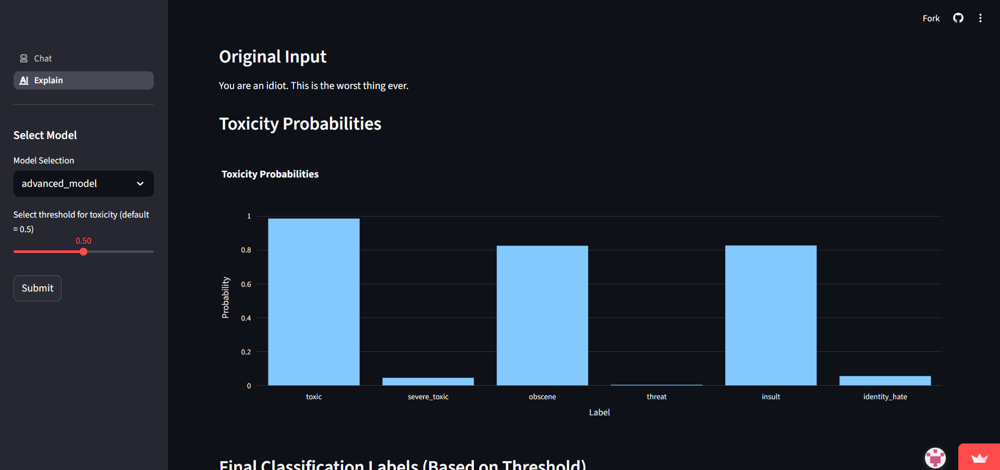
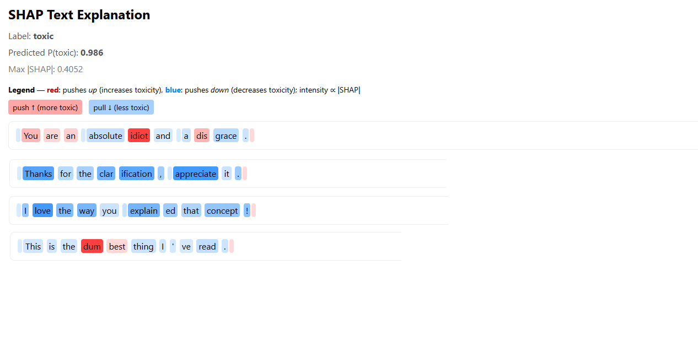

<div align="center">

# 🗣️ CleanSpeech: Toxicity Detection and Rewriting with Explainable AI

<p><i>An integrated solution for multi-label toxicity classification, SHAP-based explainability, and constructive text rewriting using the Gemini API.</i></p>

</div>

<p align="center">
  
  
  
  
  
</p>

> **CleanSpeech** fine-tunes **mDeBERTa-v3-base** for multi-label toxicity classification and uses **Gemini API** to rewrite harmful text into non-toxic alternatives. A Streamlit UI provides real-time predictions and **SHAP-based explainability**, helping users communicate better and maintaining safer online spaces.

---

## 🚀 Getting Started

The CleanSpeech application is hosted via Streamlit for an interactive demo.

### 🌐 Visit Online
* **Demo URL:** `[<deployed url>`](https://cleanspeech.streamlit.app/)
* **API Endpoint (Hugging Face Spaces):** `https://milanchndr-Toxic-Comment-Classifier-Explainer.hf.space`

### 💻 Run Locally

1.  **Clone the repository:**
    ```bash
    git clone <your-repo-link>
    cd CleanSpeech
    ```
2.  **Set up the environment:**
    ```bash
    cd ui
    pip install -r requirements.txt
    ```
3.  **Run the Streamlit application:**
    ```bash
    streamlit run app.py
    ```

---

## ✨ Features & Architecture

CleanSpeech provides an integrated **Detect → Explain → Rewrite** pipeline.

### Core Architecture


**Figure:** CleanSpeech System Architecture Overview

The system is designed with three primary, modular components:

1.  **Toxicity Detection:** **mDeBERTa-v3** is fine-tuned to perform multi-label classification (6 categories) and assign a severity score.
2.  **Explainability:** **SHAP** (Shapley Additive Explanations) is used post-hoc to highlight words that contribute most positively or negatively to the toxicity prediction.
3.  **Constructive Rewriting:** The **Gemini API** generates a polite, non-toxic alternative that preserves the original comment's semantic intent.


### Project Stack

| Category | Components | Details |
| :--- | :--- | :--- |
| **Classifier** | **mDeBERTa-v3-base** (Hugging Face) | Multi-label, multilingual toxicity detection. |
| **Rewriter** | **Gemini API** | Generative AI for constructive text detoxification. |
| **Explainability** | **SHAP** / LIME | Model-agnostic interpretability for word-level contributions. |
| **Frontend/UI** | **Streamlit** | Interactive web application for real-time demo. |
| **Data** | Jigsaw Toxic Comment Classification | Primary training dataset. |
| **Backend** | Python (Pandas, Scikit-learn, Transformers) | Core data science and pipeline components. |

---

## 📈 Project Progress

| Milestone | Description | Status |
| :--- | :--- | :--- |
| **1. Problem Definition & Lit Review** | Defined objectives and reviewed existing toxicity detection methods. |  |
| **2. Data Preparation & Preprocessing** | Cleaned dataset, handled duplicates, created `clean_text`, and generated train/val/test splits. |  |
| **3. Model Architecture Design** | Designing baseline and transformer models for toxicity classification. |  |
| **4. Model Training & Evaluation** | Transformer model training completed on Jigsaw dataset. |  |
| **5. Model Evaluation & Analysis** | Final performance metrics, threshold tuning, XAI validation, and API documentation completed. |  |

---

## 🔎 Detailed Milestone Summary

Detailed documentation for each milestone is available in the `doc` folder.

### **Milestone 1: Problem Definition & Literature Review**
* **Goal:** To establish the need for an explainable, constructive moderation system.
* **Key Finding:** Existing tools lack transparency and provide no guidance on improving communication.
* **Conclusion:** Our system must move beyond binary scoring to provide **multi-label classification**, **severity scoring**, **SHAP-based explanations**, and **constructive rewriting**.
* **Proposed Methodology:** Adopt the **mDeBERTa-v3** transformer model for its superior contextual and multilingual capability, and use the **Gemini API** for high-quality text rewriting.

### **Milestone 2: Dataset Preparation and Preprocessing**
* **Primary Dataset:** **Jigsaw Toxic Comment Classification** for robust multi-label training.
* **Testing Dataset:** **HASOC (Hate Speech and Offensive Content)** for evaluating generalization to social media data, including **code-mixed** languages (e.g., Hinglish).
* **Preprocessing:** Applied an effective cleaning pipeline (URL/HTML tag removal) and performed a **stratified 80-20 train-validation split** to maintain label distribution. The HASOC dataset was augmented using the Gemini API to align its labels with our multi-label classification schema.

### **Milestone 3: Architecture Justification**
* **Classifier Choice:** **mDeBERTa-v3-base** was selected for its **Disentangled Attention Mechanism** (better context understanding) and multilingual support.
* **Loss Function:** **Weighted Binary Cross-Entropy (WBCE)** is used to mitigate the severe class imbalance, ensuring rare but critical categories like `threat` and `identity_hate` are weighted appropriately.
* **Rewriter Design:** The **Gemini API** is prompted to ensure **semantic preservation** (maintaining the user's core intent) while neutralizing the toxic tone.

### **Milestone 4: Model Training**
* **Model:** Fine-tuned **`microsoft/mdeberta-v3-base`** (183 M parameters).
* **Optimization:** **AdamW** optimizer with a learning rate of $2 \times 10^{-5}$ and a $10\%$ linear warm-up scheduler for stable and efficient training convergence.
* **Objective:** To achieve high performance (target F1-score > 80%) across all six toxicity categories using the processed Jigsaw dataset.

### **Milestone 5: Model Evaluation & Analysis**

This milestone focused on validating the model's generalization, tuning final prediction thresholds, and integrating the Explainable AI (XAI) and rewriting modules.

#### **Quantitative Results**
The model demonstrated strong discriminative performance and reliability on the unseen test set.

| Metric | Value | Details |
| :--- | :--- | :--- |
| **Macro ROC-AUC** | **0.983** | High threshold-independent discrimination ability across all six classes. |
| **Macro F1 (Optimized)** | **0.68** | F1 improved by ~8% after optimizing thresholds for each label. |
| **Rewriter Quality (BERTScore)** | **0.948** | Confirms high semantic similarity between toxic input and constructive rewrite. |

#### **Optimal Thresholds**
To balance Precision and Recall for imbalanced classes, label-wise thresholds were optimized:

| Label | Optimized F1 | Final Threshold |
| :--- | :--- | :--- |
| **toxic** | 0.74 | 0.42 |
| **severe_toxic** | 0.55 | 0.38 |
| **obscene** | 0.78 | 0.47 |
| **threat** | 0.61 | 0.33 |
| **insult** | 0.72 | 0.46 |
| **identity_hate** | 0.67 | 0.40 |

#### **Qualitative Validation**
* **Explainability:** SHAP/Perturbation analysis confirmed that the model focuses on semantically toxic tokens (e.g., *"idiot"*, *"hate"*) when making positive predictions.
* **Rewriting:** Gemini 2.5 successfully neutralized toxic language while maintaining the original intent (e.g., converting *"You are such an idiot and I hate you!"* to *"I strongly disagree with your approach and find it frustrating."*).

---

## 🖼️ Streamlit Interface

The web interface is designed for maximum clarity and user experience:
* **Input Field:** Allows users to paste or type text for analysis.
* **Classification Output:** Displays multi-label categories and overall severity (Mild, Moderate, Severe).
* **Explainability Graph:** Shows **SHAP/LIME visualizations** highlighting which words contributed most to the toxic prediction.
* **Rewriting Pane:** Presents the polite, constructive alternative generated by the Gemini API.

`<the ui guidance>`


---
## Explainablity using SHAP


---
## 🔗 API Documentation: Analyze Text Endpoint

The core functionality is exposed via a public API endpoint on Hugging Face Spaces.

### `POST /predict`

Analyzes text for toxicity, providing probabilities and word-level importance scores.

| Key | Type | Description |
| :--- | :--- | :--- |
| **`text`** | *string* | The input text string for analysis. |

**Example Request (using `curl`):**
```bash
curl -X POST "[https://milanchndr-Toxic-Comment-Classifier-Explainer.hf.space/predict](https://milanchndr-Toxic-Comment-Classifier-Explainer.hf.space/predict)" \
-H "Content-Type: application/json" \
-d '{"text": "You are an idiot and I hate you!"}'
