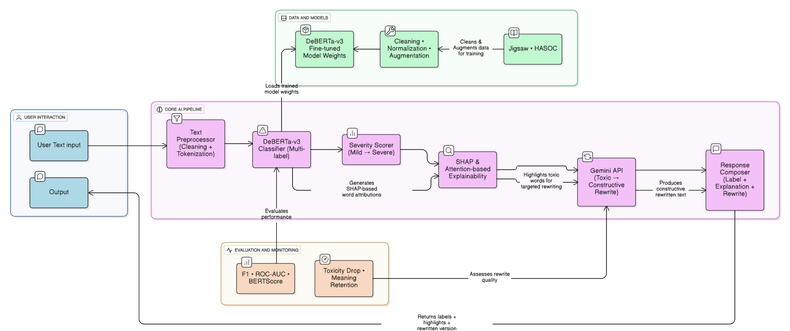
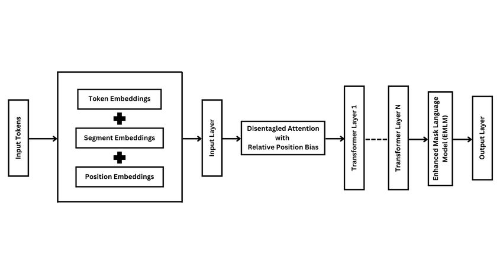
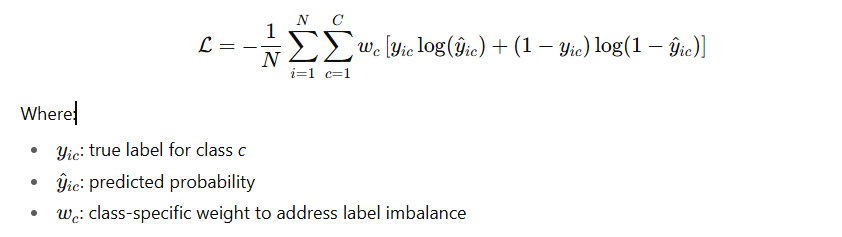

# **Milestone 3: Architecture Justification**


**Figure:** CleanSpeech System Architecture Overview

---


**Figure:** mDeBERTa-v3 Transformer Architecture

## **1. Overall Design Rationale**

The CleanSpeech architecture integrates modular components for toxicity detection, explainability, and constructive rewriting. The design prioritizes contextual accuracy, interpretability, and rewrite quality while maintaining flexibility for future model updates.

The architecture follows a linear yet modular flow:

1. **User Input** – The system receives a text or comment.
2. **Preprocessing** – Cleaning and tokenization standardize the input before classification.
3. **Classification** – The **mDeBERTa-v3** model performs multi-label toxicity detection and assigns severity scores (Mild → Severe).
4. **Explainability & Scoring** – SHAP-based contribution graphs highlight influential tokens and severity levels.
5. **Rewriting** – The **Gemini API** rewrites toxic text into constructive, polite alternatives.
6. **Response Composition** – Labels, explanations, and rewritten text are integrated and returned to the user.

This modular design ensures interpretability and maintainability—each component (classification, explainability, rewriting) can evolve independently.

---

## **2. Choice of Base Model: mDeBERTa-v3**

**Model:** *Multilingual DeBERTa-v3 (mDeBERTa)* or
**Task:** Multi-label toxicity detection (`toxic`, `severe_toxic`, `obscene`, `threat`, `insult`, `identity_hate`)

### **Justification**

* **Disentangled Attention Mechanism:** Separates content and positional encodings, enabling deeper context understanding—essential for nuanced or sarcastic toxicity.
* **Superior Contextual Representation:** The enhanced masked decoder and replaced-token detection (RTD) reduce false positives and improve semantic sensitivity.
* **Multilingual Capability:** Handles English and code-mixed (Hindi-English) data natively.
* **Proven Performance:** Consistently achieves SOTA results across GLUE/SuperGLUE tasks, ensuring robustness for complex language moderation.

Although **mDeBERTa-v3** is currently the selected backbone, the architecture is designed for modularity. During the **testing phase**, the team may experiment with **ModernBERT** as an alternative encoder. If ModernBERT demonstrates superior contextual performance or inference efficiency, it may replace mDeBERTa in the classifier module without altering the downstream components (explainability and rewriting).

---

## **3. Transformer Internal Block Summary**

Within mDeBERTa-v3, the architecture follows the **standard transformer encoder design** with key enhancements:

* **Self-Attention Layers:** Compute contextual relationships among tokens using scaled dot-product attention.
* **Disentangled Attention:** DeBERTa encodes *content* and *position* separately, allowing finer control over word meaning and order.
* **Feed-Forward Network (FFN):** A two-layer fully connected network with GELU activation refines representations post-attention.
* **Residual Connections & Layer Normalization:** Preserve gradient flow and ensure training stability.
* **Output Layer:** A classification head (dense layer + sigmoid activation) produces six toxicity probabilities for multi-label prediction.

---

## **4. Dataset Organization & Preprocessing Summary**

### **Datasets Used**

* **Training & Validation:** Jigsaw Toxic Comment Classification
* **Testing & Generalization:** Jigsaw Toxic Comment Classification and HASOC (Hate Speech and Offensive Content)
* **Explainability Validation:** Jigsaw Toxic Comment Classification 

### **Preprocessing Highlights**

* **Cleaning & Normalization:** Removed URLs, HTML tags, emojis, and special characters; normalized whitespace.
* **Language Preservation:** Retained hashtags and mentions where semantically relevant.
* **Stratified Splits:** Ensured proportional toxic/non-toxic representation across train/validation sets.
* **Augmentation (HASOC):** Leveraged Gemini API for multi-label augmentation aligned with Jigsaw label schema.
* **Tokenization:** Used the **DeBERTa tokenizer** with truncation/padding to 256 tokens per sample.

---

## **5. Loss Function**

To handle **multi-label imbalance**, the model uses **Weighted Binary Cross-Entropy Loss (WBCE)**:



This ensures severe but underrepresented toxicity classes (like `threat` or `identity_hate`) are not overshadowed by frequent mild categories.

---

## **6. Explainability and Scoring**

The **SHAP & Attention-based Explainability** module quantifies token-level contributions. SHAP values highlight which words increase toxicity scores, while attention visualization shows model focus regions. The **Severity Scorer** maps predicted probabilities to ordinal toxicity levels (Mild → Moderate → Severe).

---

## **7. Rewriting Module**

The **Gemini API** is prompted for *constructive rewriting*.
It ensures that:

* Toxic elements are neutralized,
* Intent and semantics are preserved,
* Tone becomes polite and contextually appropriate.

Each rewrite is accompanied by a short natural-language **explanation** for user learning.

---

## **8. Output Format**

The **Response Composer** merges the three components into a unified JSON-like response:

```json
{
  "labels": {
    "toxic": 1,
    "insult": 1,
    "threat": 0,
    "identity_hate": 0
  },
  "severity": "Moderate",
  "explanation": "The words 'idiot' and 'stupid' contribute most to toxicity.",
  "rewritten_text": "I think that idea could be improved, but let's discuss calmly."
}
```

This structured output is ideal for both user display and API integration.

---

## **9. Evaluation and Monitoring**

The **Evaluation Block** monitors both performance and rewrite quality:

* **Quantitative Metrics:** F1-score, ROC-AUC, and BERTScore
* **Qualitative Metrics:** Toxicity Drop and Meaning Retention
* **Continuous Monitoring:** Detects model drift and ensures fairness during deployment.

---

## **10. Summary**

| Component           | Method / Model                      | Purpose                        | Justification                                                    |
| ------------------- | ----------------------------------- | ------------------------------ | ---------------------------------------------------------------- |
| **Classifier**      | mDeBERTa-v3                         | Multi-label toxicity detection | Strong contextual understanding, multilingual, robust benchmarks |
| **Explainability**  | SHAP values + Attention-based graph | Transparent reasoning          | Token-level contribution visualization                           |
| **Severity Scorer** | Rule-based scaling                  | Intensity estimation           | Differentiates mild–severe toxicity                              |
| **Rewriting**       | Gemini API                          | Constructive text rewriting    | Politeness preservation & semantic consistency                   |
| **Loss Function**   | Weighted Binary Cross-Entropy       | Handle class imbalance         | Ensures fairness across rare toxicity classes                    |
| **Evaluation**      | F1, ROC-AUC, BERTScore              | Model performance & quality    | Ensures fairness and meaning retention                           |


