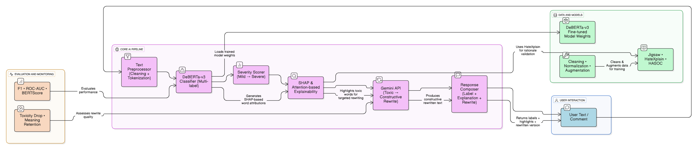

# **Architecture Justification**

The CleanSpeech architecture integrates modular components for toxicity detection, explainability, and constructive rewriting. The design prioritizes contextual accuracy, interpretability, and rewrite quality while maintaining flexibility for future model updates.

---

## **1. Overall Design Rationale**

The architecture follows a linear yet modular flow:

1. **User Input** – The system receives a text or comment.
2. **Preprocessing** – Cleaning and tokenization standardize the input before classification.
3. **Classification** – The **mDeBERTa-v3** model performs multi-label toxicity detection with Scales toxicity intensity (Mild → Severe)
4. **Explainability & Scoring** – SHAP-based contribution graphs highlight influential tokens and severity scores are generated.
5. **Rewriting** – The **Gemini API** rewrites the toxic text into a constructive form.
6. **Response Composition** – Labels, explanations, and rewritten text are integrated and returned to the user.

This modular architecture allows each component (classification, explainability, rewriting) to evolve independently, simplifying experimentation and model replacement.

---

## **2. Choice of Base Model: mDeBERTa-v3**

**Selected Model:** *mDeBERTa-v3 (Multilingual DeBERTa)*
**Task:** Multi-label classification (toxic, severe_toxic, obscene, threat, insult, identity_hate)

### **Justification:**

* **Disentangled Attention Mechanism:**
  mDeBERTa separates content and positional representations, enhancing context understanding—crucial for detecting implicit or sarcastic toxicity that traditional encoders often miss.

* **Superior Contextual Representation:**
  DeBERTa-v3 introduces improved masked decoding and replaced-token detection (RTD), which enhance semantic accuracy and reduce false positives in nuanced comments.

* **Multilingual & Code-Mixed Capability:**
  The multilingual variant (mDeBERTa) can handle English and code-mixed Hindi-English text without retraining, which aligns with real-world comment diversity.

* **Proven Benchmark Performance:**
  DeBERTa-v3 consistently outperforms earlier transformer models like BERT, RoBERTa, and DistilBERT across GLUE and SuperGLUE benchmarks, demonstrating robustness in context-sensitive tasks.

---

## **3. Explainability and Scoring**

The **SHAP & Attention-based Explainability** module quantifies token-level contributions, providing transparent reasoning for each classification. This aids interpretability, model debugging, and trustworthiness. The **Severity Scorer** complements it by scaling detected toxicity from mild to severe, enabling context-aware rewriting.

---

## **4. Rewriting Module**

The **Gemini API** is used for controlled rewriting through predefined prompt templates. It ensures:

* The toxic elements are neutralized,
* The original intent remains preserved, and
* The rewritten output is natural and polite.

This stage forms the bridge between model prediction and actionable user feedback.

---

## **5. Evaluation and Monitoring**

The **evaluation block** tracks both quantitative and qualitative metrics:

* **Quantitative:** F1, ROC-AUC, and BERTScore to validate model performance.
* **Qualitative:** “Toxicity Drop” and “Meaning Retention” metrics to ensure rewrites are both effective and semantically consistent.

This dual evaluation ensures the pipeline maintains fairness and reliability.

---

## **6. Flexibility for Model Replacement**

Although **mDeBERTa-v3** is currently the selected backbone, the architecture is designed for modularity.
During the **testing phase**, the team may experiment with **ModernBERT** as an alternative encoder.
If ModernBERT demonstrates superior contextual performance or inference efficiency, it may replace mDeBERTa in the classifier module without altering the downstream components (explainability and rewriting).

This adaptability ensures long-term scalability and compatibility with evolving transformer architectures.

---

## **7. Summary**

| Component           | Method / Model                      | Purpose                        | Justification                                                    |
| ------------------- | ----------------------------------- | ------------------------------ | ---------------------------------------------------------------- |
| **Classifier**      | mDeBERTa-v3                         | Multi-label toxicity detection | Strong contextual understanding, multilingual, robust benchmarks |
| **Explainability**  | SHAP values + Attention-based graph | Transparent reasoning          | Token-level contribution visualization                           |
| **Severity Scorer** | Rule-based scaling                  | Intensity estimation           | Differentiates mild–severe toxicity                              |
| **Rewriting**       | Gemini API                          | Constructive text rewriting    | Politeness preservation & semantic consistency                   |
| **Evaluation**      | F1, ROC-AUC                         | Model performance & quality    | Ensures fairness and meaning retention                           |

