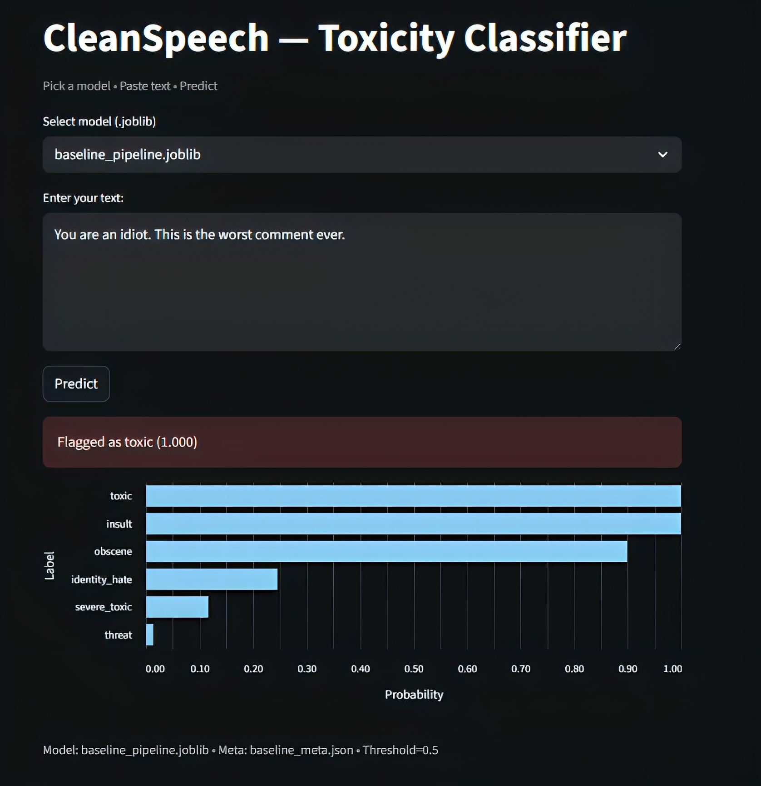
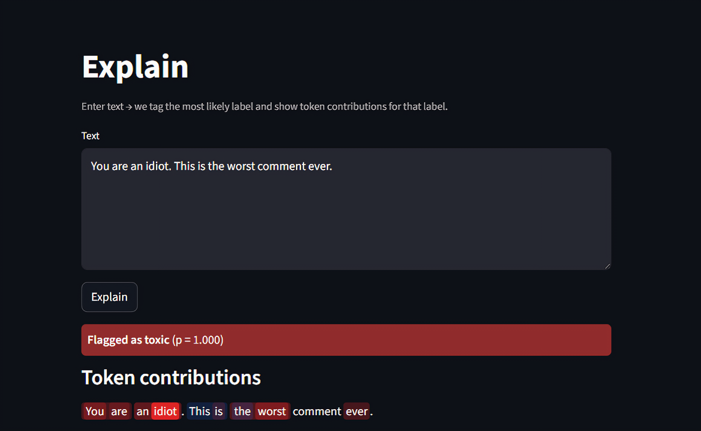

# Milestone 3: Architecture Justification

# This document outlines the architecture design and justification for the CleanSpeech toxicity detection and rewriting system.

# This will explain the classification process and model architecture.

# This will explain the explainability process and model architecture.
